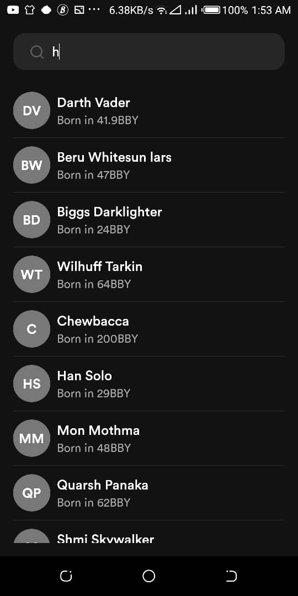
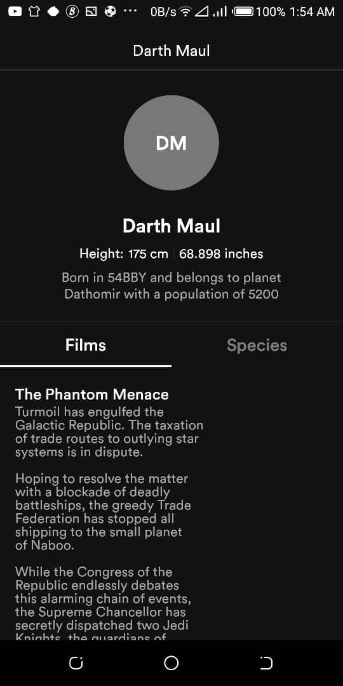
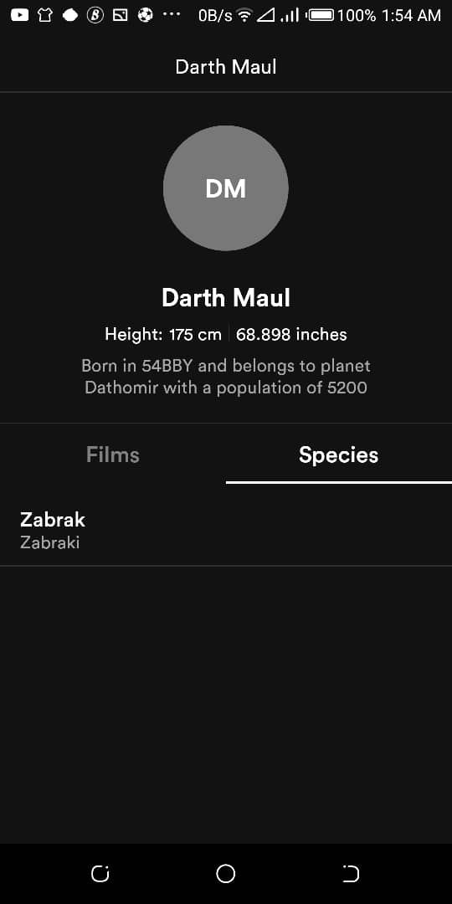

# Star Wars

An Android application to showcase Star Wars characters. The application allows user to search
for Star Wars characters and view the details of each character. The application consumes
data from the [Star Wars API](https://swapi.dev/)

Minimum Api Level : 22
compileSdkVersion : 30

Build System : [Gradle](https://gradle.org/)

## Table of Contents

- [Architecture](#architecture)
- [Libraries](#libraries)
- [Solution](#solution)
- [Testing](#testing)
- [Organisation](#organisation)
- [Demo](#demo)


## Architecture

Since the application is expected to scale with multiple developers working
on it, I used the Clean architectural principles to build the application.
I choose this architecture because it fosters better separation of concerns
and testability.

The Application is split into a three layer architecture:

- Data
- Domain
- Presentation


#### Data

The data layer handles the business logic and provides data from the
star wars API and a local database leveraging Room. This layer uses the
Repository pattern to fetch data from various data sources which in
this case is the Star Wars API and a local database.


#### Domain

The domain layer contains the application specifics logic. It contains
interactors/use cases that expose the actions that can be performed in the application.

The UseCases use a ```BaseUseCase``` interface that defines the parameters its taking in and
output and also handles running the UseCases in a background thread leveraging Kotlin Coroutines.


#### Presentation

I used the MVVM pattern for the presentation layer. The Model essentially exposes
the various states the view can be in. The ViewModel handles the UI logic and provides
data via Android architectural component LiveData to the view. The ViewModel talks to
the domain layer with the individual use cases. Jetpack's Data binding is used to bind
the data declaratively to the views.


## Libraries

Libraries used in the application are:

- [Jetpack](https://developer.android.com/jetpack)
  - [Viewmodel](https://developer.android.com/topic/libraries/architecture/viewmodel) - Manage UI related data in a lifecycle conscious way
  and act as a channel between use cases and UI.
  - [Data Binding](https://developer.android.com/topic/libraries/data-binding) - support library that allows binding of UI components in layouts to data sources, binds character details and search results to UI.
  - [Room](https://developer.android.com/training/data-storage/room) - Provides abstraction layer over SQLite.
  - [LiveData](https://developer.android.com/topic/libraries/architecture/livedata) - Provides an observable data holder class.
- [Retrofit](https://square.github.io/retrofit/) - type safe http client and supports coroutines out of the box.
- [Shimmer](https://facebook.github.io/shimmer-android/) - Shimmer provides an easy way to add a shimmer effect to views in the application.
- [Moshi](https://github.com/square/moshi) - JSON Parser, used to parse requests on the data layer for Entities and understands Kotlin non-nullable
and default parameters.
- [okhttp-logging-interceptor](https://github.com/square/okhttp/blob/master/okhttp-logging-interceptor/README.md) - logs HTTP request and response data.
- [kotlinx.coroutines](https://github.com/Kotlin/kotlinx.coroutines) - Library Support for coroutines. I used this for asynchronous programming in order
to obtain data from the network as well as the database.
- [JUnit](https://junit.org/junit4/) - This was used for unit testing the repository, the use cases and the ViewModels.
- [Mockk](https://mockk.io/) This is a mocking library for Kotlin. I used it to provide test doubles during testing.
- [Truth](https://truth.dev/) - Assertions Library, provides readability as far as assertions are concerned.
- [Hilt](https://github.com/InsertKoinIO/koin) - Dependency injection plays a central role in the architectural pattern used.
For this reason I have chosen Hilt which is built on top of the battle tested DI framework - Dagger 2.
- [Robolectric](http://robolectric.org/) - Unit test on android framework.

## Solution

I decided to use the single Activity with multiple fragments approach.
Once the activity is fired up, the ```CharacterSearchFragment``` is added to the backstack.
The ```CharacterSearchFragment``` is responsible for showing the list of searched characters.
At first, the fragment reaches out to the ViewModel to fetch recently searched characters
(if any) from the local database. I have done this so the user does not see a relatively empty
screen on app startup. The user can search for characters via a search input field on this screen.
As the user types, the fragment reaches out to the ViewModel to obtain the characters that match the
input string. The ViewModel delegates to the ```GetCharacterUseCase``` which is responsible for searching
for characters. The ```GetCharacterUseCase``` via a repository interface requests this data from the data layer.
The data layer retrieves the data from the API and persists the first ten characters to the local database
via a Room DAO. It is this persisted data that I referred to as the recent characters.
Also, when the search string is empty, the ViewModel invokes the ```GetRecentCharacters``` UseCase instead.
The ```GetRecentCharacters``` also reaches out to the repository which gets the persisted characters from
the local database.
Furthermore, clicking on any character in the list triggers the ```CharacterDetailsFragment```.
The basic character information like name, birth year, and height are passed to the ```CharacterDetailFragment```
using a Percable ```SCharacterPresentation``` object. This screen reaches out to the ```CharacterDetailsViewModel```
to retrieve the planet details of the character. There is a ```ViewPager``` on the CharacterDetails screen which
uses two other fragments to show species and films the character has appeared in. The two fragments
are ```CharacterFilmsFragment``` and ```CharacterSpecieFragment```. The fragments essentials take in the
film's URLs and species URLs respectively. The two fragments have their ViewModels. The reason behind this
is I envisaged a time in the future where we would like to extract either the films or species to a separate screen.

In general, any particular flow can be said to follow the steps below:
- The view sends an action to the ViewModel
- The ViewModel reaches out to the UseCase/Interactor
- The UseCase via an abstraction layer reaches out to the repository
- The repository decides where to get the data from and returns (mapped to domain representation) either a success or a failure via a Sealed Either class.
- The UseCase gets the returned value and hand it over to the ViewModel
- The ViewModel maps the returned value to the presentation object.
- Finally, the ViewModel creates a view to model the state of the view and hand it over the view leveraging DataBinding.

## Testing

The different layer has various test cases.

The data layer has tests for the repository and DAO. To test the repository, test doubles were provided for the API service and DAO.
To test the DAO, a memory-based Room database was used and this was largely made possible by AndroidX test library and Roboelectric.

The UseCases were also tested by ensuring the UseCases called the right repository methods.

The presentation layer also has unit tests for the viewmodels and util classes.

## Organisation
I decided to organize my code based on features. Since many developers are expected to work on the project,
developers can easily spot the folder to work on based on feature. This can also potentially reduce merge
conflicts. It also makes it easy for new developers to come on board and if we want, we can easily have
developers dedicated to different features of the application.

## Demo

Find below screenshots of the application

||||
|:----:|:----:|:----:|


